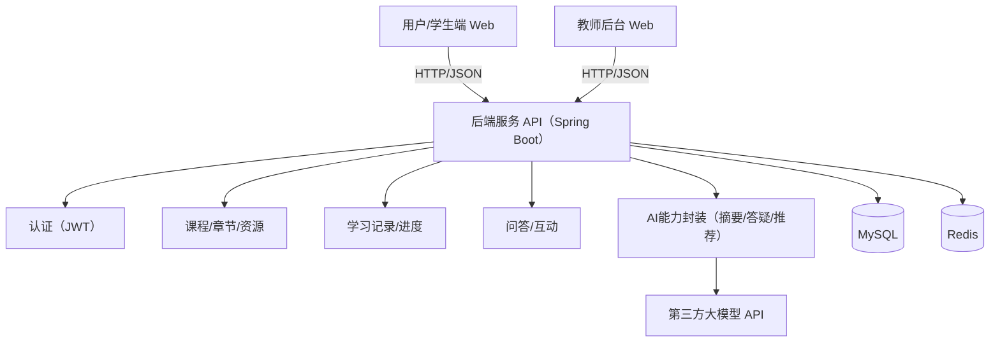
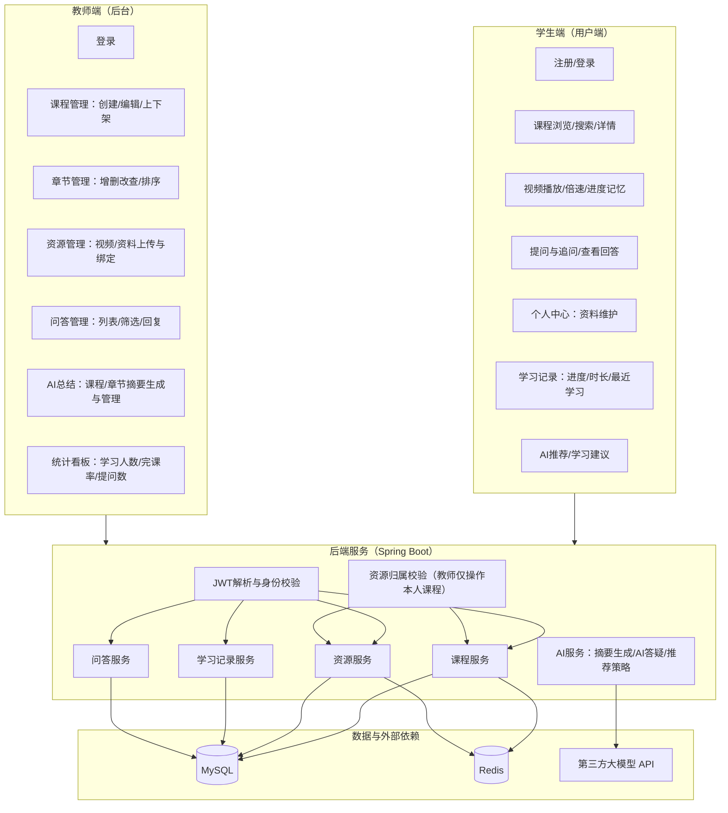

## 功能模块图

### 1. 总体功能模块图

```mermaid
flowchart TB
  U[用户/学生端 Web] -->|HTTP/JSON| API[后端服务 API（Spring Boot）]
  T[教师后台 Web] -->|HTTP/JSON| API

  API --> AUTH[认证（JWT）]
  API --> COURSE[课程/章节/资源]
  API --> STUDY[学习记录/进度]
  API --> QA[问答/互动]
  API --> AI[AI能力封装（摘要/答疑/推荐）]

  API --> DB[(MySQL)]
  API --> CACHE[(Redis)]

  AI --> LLM[第三方大模型 API]
```

### 2. 详细功能模块图（按端与业务拆解）

```mermaid
flowchart TB
  subgraph S[学生端（用户端）]
    S1[注册/登录]
    S2[课程浏览/搜索/详情]
    S3[视频播放/倍速/进度记忆]
    S4[提问与追问/查看回答]
    S5[个人中心：资料维护]
    S6[学习记录：进度/时长/最近学习]
    S7[AI推荐/学习建议]
  end

  subgraph T[教师端（后台）]
    T1[登录]
    T2[课程管理：创建/编辑/上下架]
    T3[章节管理：增删改查/排序]
    T4[资源管理：视频/资料上传与绑定]
    T5[问答管理：列表/筛选/回复]
    T6[AI总结：课程/章节摘要生成与管理]
    T7[统计看板：学习人数/完课率/提问数]
  end

  subgraph B[后端服务（Spring Boot）]
    B1[JWT解析与身份校验]
    B2[资源归属校验（教师仅操作本人课程）]
    B3[课程服务]
    B4[资源服务]
    B5[学习记录服务]
    B6[问答服务]
    B7[AI服务：摘要生成/AI答疑/推荐策略]
  end

  subgraph D[数据与外部依赖]
    D1[(MySQL)]
    D2[(Redis)]
    D3[第三方大模型 API]
  end

  S --> B
  T --> B

  B1 --> B3
  B1 --> B4
  B1 --> B5
  B1 --> B6
  B2 --> B3
  B2 --> B4
  B3 --> D1
  B4 --> D1
  B5 --> D1
  B6 --> D1
  B7 --> D3
  B3 --> D2
  B4 --> D2
```

